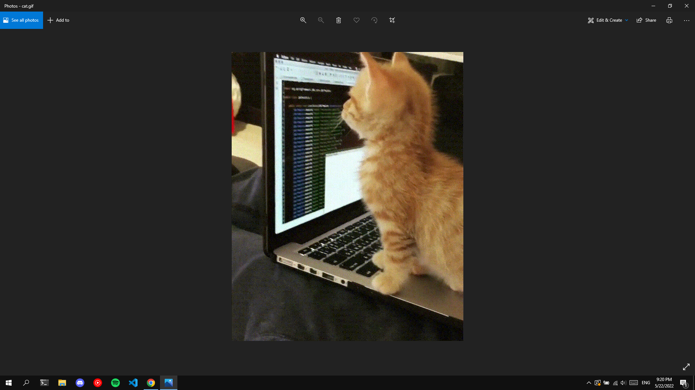

# About

Hi👋   
My name’s Filip.  
I am a Frontend developer interested in web and android technologies.  
I love working on fun and interesting projects and keeping up with the urban programming world.  
My frontend framework (library) of choice is **React**.  
I also love open-source projects and orange cats :)      
 

